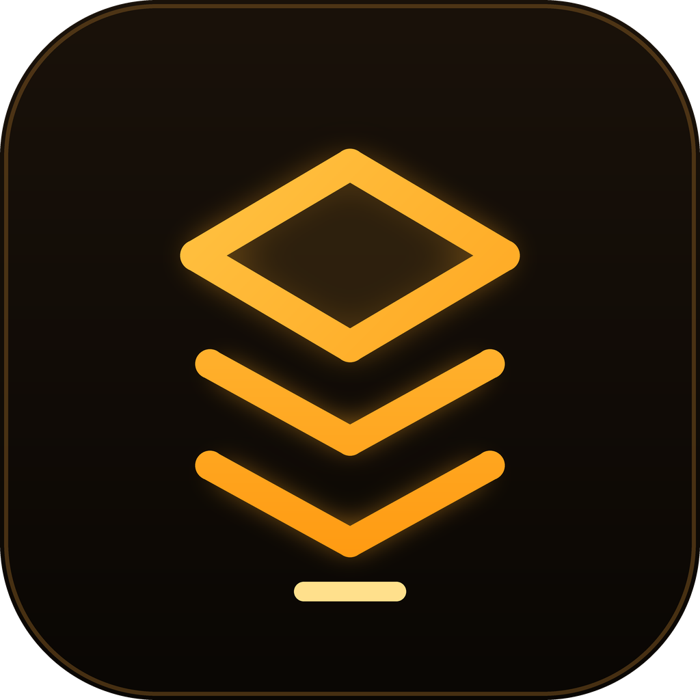

<p align="center">
  
</p>

<h1 align="center">StackPrep</h1>

<p align="center">
  <strong>Coding interview preparation for Kotlin, Swift, Flutter, and React Native developers.</strong><br>
  Master the interview loop in your stack, calibrated to your experience level.
</p>

<p align="center">
  
  
  
  
</p>

---

StackPrep is a terminal-inspired, dark-mode interview-prep app for mobile developers. It ships a full curriculum — **60 modules, 600 MCQs, and ~138 flipcards across Kotlin, Swift, Flutter, and React Native** — and tracks how interview-ready you are with a mastery score, streak, and daily challenge. Everything is graded by runtime level (<em>Junior / Mid-Level / Senior</em>).

## Features

- **Terminal boot experience** — an animated 3D octahedron hero mark, typewriter boot log, and a glowing `SYSTEM START` button (built with a hand-rolled `CustomPainter`, no 3D engine).
- **Personalized onboarding** — pick your tracks (multi-select), set your experience level, and get a "System Initialized" recap persisted to your profile.
- **Home dashboard** — daily greeting, streak counter, activity heatmap, a rotating **Daily Challenge** (10-question quiz per track, locked once completed each day), a Continue card with a mastery ring, and a **Weak Topics** list that deep-links into the flagged module.
- **Practice sessions** — searchable track list with competency badges; MCQ quizzes per topic, module, or daily challenge; and a review-style summary with per-question breakdown.
- **Curriculum browser** — module content with heading/explanation/code blocks, skeleton loading states, and quiz buttons throughout.
- **3D flashcards** — flip animations over concept cards with code snippets; master or review-later each card.
- **Interview-readiness progress** — an overall readiness score weighted across activity channels (MCQ 30%, quiz 30%, flashcard 20%, daily challenge 10%, module completion 10%) over a 91-day window, per-track competency bars, focus-area chips with trend indicators, and a heatmap.
- **Engineer ladder profile** — L1/L2/L3 derived from your experience level, account & security settings, open/manage tracks, and sign-out.

## Tech Stack

- **Framework** — Flutter / Dart (SDK `^3.13.0`)
- **State management** — `flutter_bloc` (Bloc for auth + practice session, Cubits for onboarding, progress, and topics)
- **Dependency injection & errors** — `get_it`, `dartz` (`Either<Failure, …>`), `equatable`
- **Backend** — Firebase `firebase_core`, `firebase_auth`, `cloud_firestore`, `google_sign_in`
- **Local persistence** — `shared_preferences` (onboarding flags, daily-challenge lock state)
- **UI / UX** — `flutter_screenutil` (393×852 design frame), `google_fonts` (Inter, JetBrains Mono), `skeletonizer`, custom animated splash, `flutter_launcher_icons` adaptive icons (Android/iOS/macOS/Windows/web)

## Getting Started

### Prerequisites

- Flutter SDK (`^3.13.0`)
- A configured Firebase project (`stackprep-e9ddd` or your own), with native config files:
  - `android/app/google-services.json`
  - `ios/Runner/GoogleService-Info.plist`

The app initializes Firebase without explicit options (`Firebase.initializeApp()`) and reuses these native configs.

### Run

```sh
flutter pub get
flutter run
```

### Seed the curriculum

The curriculum is not bundled in the app by default. It is written to Firestore with a one-click seeder. In `lib/main.dart`, swap the app's `home` for the dev seed page:

```dart
home: const SeedPage(),
```

then follow the **Seed All** flow (`lib/features/dev/.../seed_page.dart`) to populate `tracks/{trackId}/modules`, questions, and flipcards for all four stacks.

## Project Structure

```
lib/
├── core/          # theme, widgets, errors, storage, router
├── features/
│   ├── auth/      # email + Google sign-in
│   ├── dev/       # Firestore seeder (Seed All)
│   ├── home/      # dashboard, daily challenge, weak topics
│   ├── onboarding/# track + level selection
│   ├── practice/  # MCQ sessions and summaries
│   ├── profile/   # engineer ladder, settings
│   ├── progress/  # readiness, competency, heatmap
│   ├── splash/    # animated boot experience
│   └── topics/    # curriculum, modules, flashcards
└── main.dart
```

Each feature follows a layered architecture (`presentation` / `domain` / `data`) with repositories abstracted behind use cases.

## Roadmap

- Light theme
- Whiteboard / system-design practice mode
- Multi-device progress sync
- Leaderboards and streak milestones